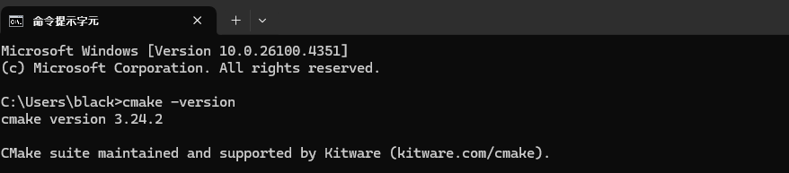
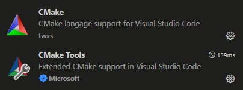
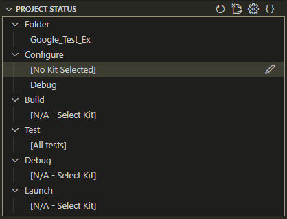
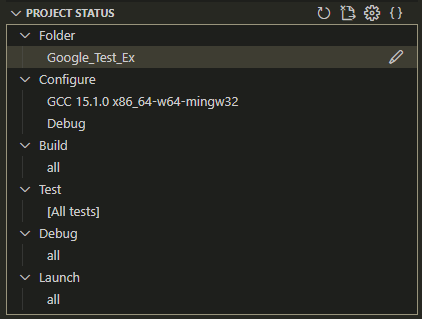
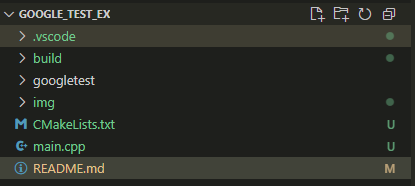
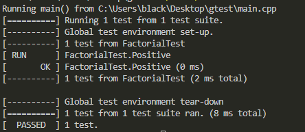

# Google_Test_Ex

1. Download Cmake. [Link](https://cmake.org/download/)
    * 如果下載的是 .msi，雙擊運行安裝程式。

    * 在安裝過程中，勾選 Add CMake to the system PATH for all users，這樣可以在命令行直接使用 cmake 命令。

    * 選擇安裝路徑，然後點擊 Install 完成安裝。
    * 驗證安裝
    ```bash
    cmake --version  
    ```

      

    * Install Visual Code Cmake extension    

    

2. Configure Project  
      
    Using compiler setting  
    
    
3. Download gtest  

```bash
https://github.com/google/googletest
```



4. Result

